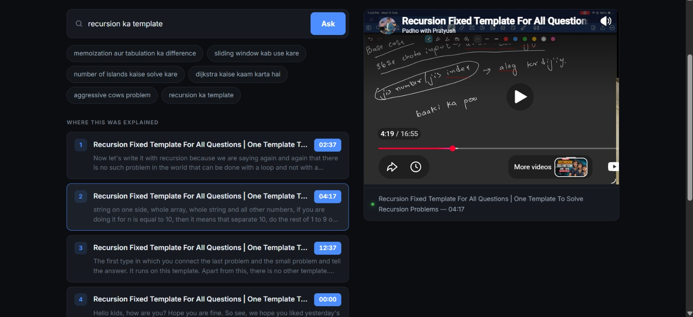
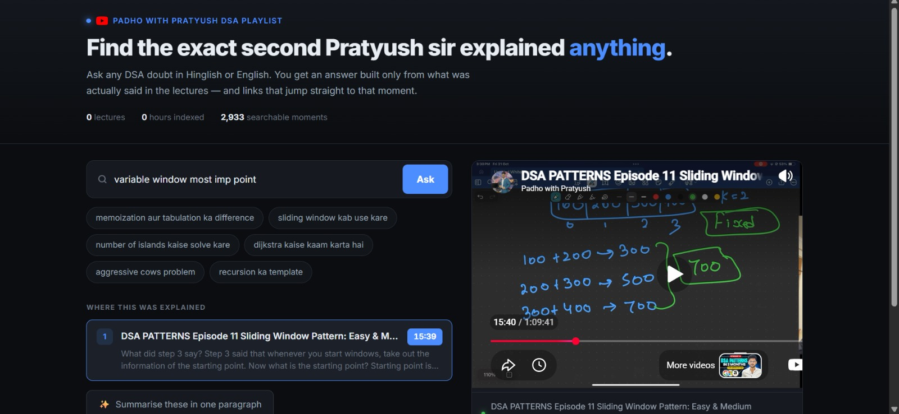
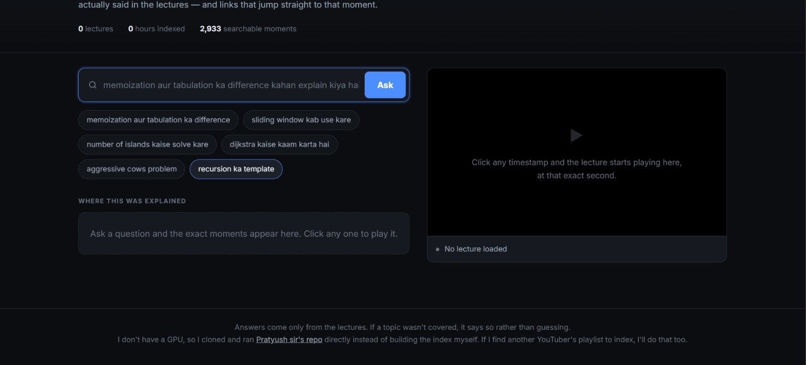
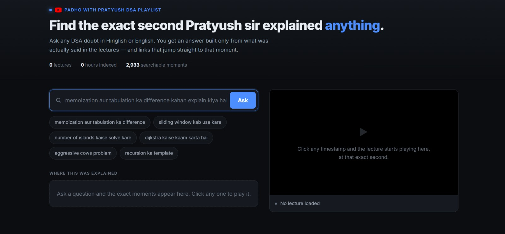

# 🎥 YouTube Playlist RAG (DSA Assistant)

Ask a question in **English or Hinglish** and get:

* ✅ A clear answer
* 🎯 **Clickable YouTube links that jump to the exact second in the lecture**

---

## 🚀 What This Project Does

Built a **Retrieval-Augmented Generation (RAG)** system over a DSA playlist:

1. Fetch playlist videos using `yt-dlp`
2. Convert audio → text using Whisper
3. Chunk transcripts (~75 sec per chunk)
4. Generate embeddings (MiniLM)
5. Store vectors in **Qdrant DB**
6. Query → retrieve top-K relevant chunks
7. LLM generates answer + **timestamped video links**

---

## ⚠️ Important Note

This project was made possible with the help of **Pratyush Sir**.
Since I don’t have a GPU, the **audio-to-text pipeline (yt-dlp + Whisper)** was taken from his implementation.

## 🧠 Key Concepts

* RAG (Retrieval + Generation)
* Embeddings & Semantic Search
* Vector DB (Qdrant)
* Chunking & Context Retrieval

---

---

## 🖼️ Screenshots

## 📌 Outcome

A working system that:

* Understands natural language queries
* Finds the **most relevant lecture moments**
* Returns **context-aware answers with direct video jumps**

---

